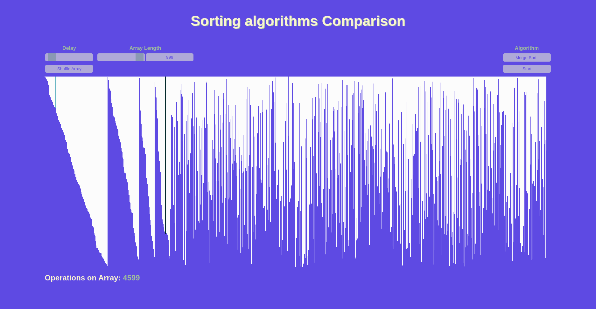

<h1>Sorting Algoritms</h1>

The content of this Github Repository was created for an school presentation, so the stuff used here may wont be equivalent to the industrial standard. The presentation is on german, but if you are interested you can download it here. 

<h2>Visualisation</h2>

The Quick-, Merge-, Bubble-, Insertion- and Selectionsort Algorithms are here visualized using the possibilities of JavaScript, HTML and CSS. It's not only made to make the algorithms easier to explain and understand but also to understand the flaws of some of them.

<h2>Implementation</h2>

I've also implemented Quick-, Merge-, Bubble- and Insertionsort going an unconventional way by using the pointer arithmetic of C, since for me its just impressive to see how compact and efficient those algorithms can be implemented using the possibilities of C pointer pointer arithmetic.

<h2>Setup</h2>

Get started by cloning the repo using following command: 

<code>git clone https://github.com/nosehad/SortingAlgorithms -b main</code>

To open the visualization of the algorithms, just open the index.html in a browser of your choice. If you want to test the implementation of the algorithms just run the build script if you are on <strong>Linux</strong>: 

<code>chmod +x main.sh && sh main.sh</code>

If you are using <strong>Windows</strong> or <strong>MacOS</strong> you should be fine by just importing the code into the IDE of your choice.

